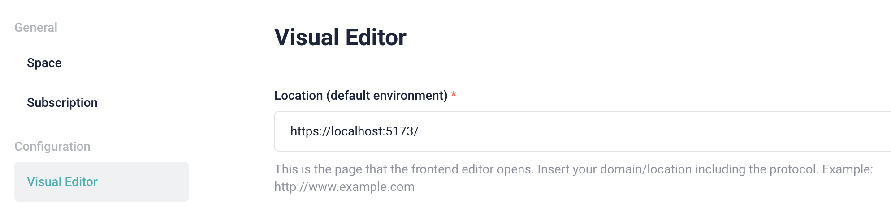
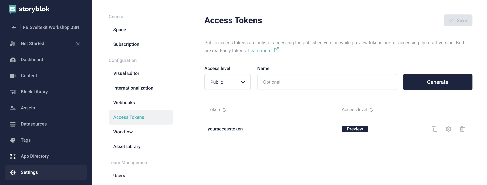

# A Hands-on Workshop

## Developing Dynamic Blogs with SvelteKit & Storyblok

This SvelteKit workshop explores how to integrate 3rd party services, such as Storyblok, in a SvelteKit project. Participants will learn how to create a SvelteKit project, leverage Svelte components, and connect to external APIs. The workshop covers important concepts, including SSR, CSR, static site generation, and deploying the application using adapters. By the end of the workshop, attendees will have a solid understanding of building SvelteKit applications with API integrations and be prepared for deployment.

## Join the Workshop

You can join this free public workshop live remotely.
Attend remote workshop live on Jun 15, 15:00 (GMT+2)

[Workshop GitNation link](https://portal.gitnation.org/contents/developing-dynamic-blogs-with-sveltekit-and-storyblok-a-hands-on-workshop)

## Setup the project

```shell
git clone https://github.com/roberto-butti/sveltekit-storyblok-workshop-jsnation.git
cd sveltekit-storyblok-workshop-jsnation
npm install
cp .env.example .env
```

Then, once you have the project in your local directory, installed the npm packages, and created the `.env` file, you can fill the access token.

## Setup Stroyblok space

### Creating Storyblok space
To obtain your access token, you have to [create a new Storyblok space](https://app.storyblok.com/#/me/spaces/new).
You can create a space for free by selecting the "Community plan".

### Configuring the Visual Editor

In the "Settings" section, selecting the "Visual Editor" tab, you can set the `Location (default environment)` with `https://localhost:5173/`



### Getting the Access Token

In the "Settings" section , selecting the "Access Tokens" tab, you can get your access token.



## Starting the local development server

The SvelteKit framework uses Vite for launching the local development web server.

In the `vite.config.js` file, you can find the Vite configuration file.

### Enabling HTTPS

To enable the HTTPS protocol, the easiest way is to install the `basicSsl` plugin:

```sh
npm i --save-dev @vitejs/plugin-basic-ssl
```

In the `vite.config.js` file, you have to use the `basicSsl` plugin:

```js
// import the basicSsl
import basicSsl from '@vitejs/plugin-basic-ssl'

export default {
  plugins: [
  	// add basicSsl() in the `plugins` list
    basicSsl()
  ]
}
```

Now, when you run `npm run dev`, the SvelteKit application is served via the default `5173` port and the `HTTPS` protocol instead of the usual `HTTP`.

So you can access to your application at: https://localhost:5173/

Why do you need to run your Sveltekit application via HTTPS protocol?
Because the Storyblok UI is delivered via the https://app.storyblok.com/ URL (so via HTTPS protocol.
The Storyblok Visual Editor for showing the real-time preview embeds the front-end (in this case, your Sveltekit application) via iframe. For security reasons, modern browsers force the loading of resources via HTTPS if the HTML page is served via HTTPS. This is valid for the resources like images, CSS files, js files, and URLs loaded via iframe. So the Visual Editor is provided via HTTPS, and the frontend embedded by the visual editor needs to be provided via HTTPS.

